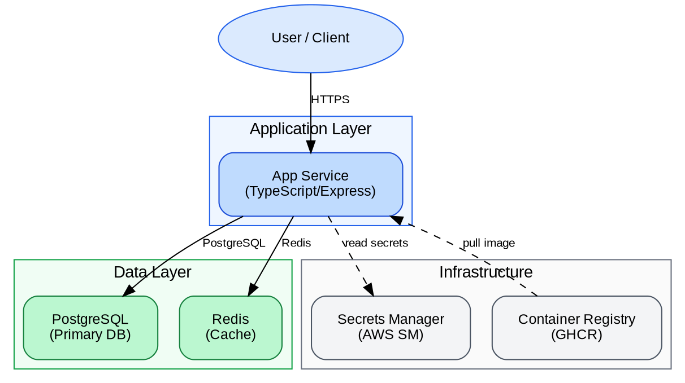
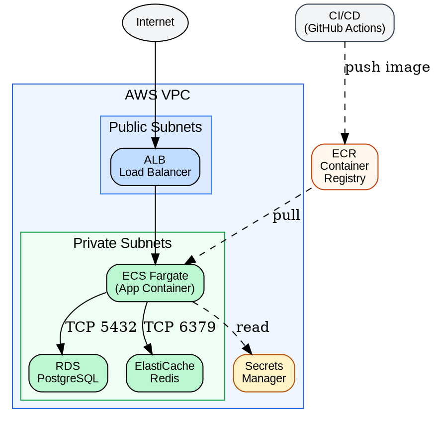
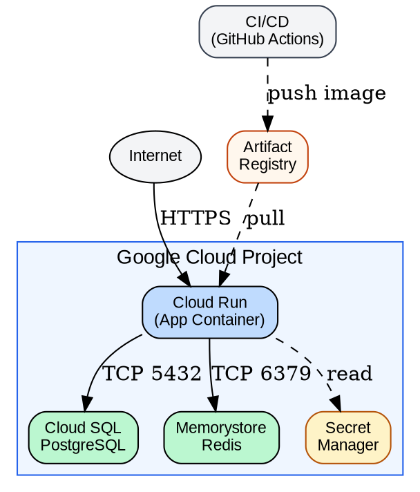
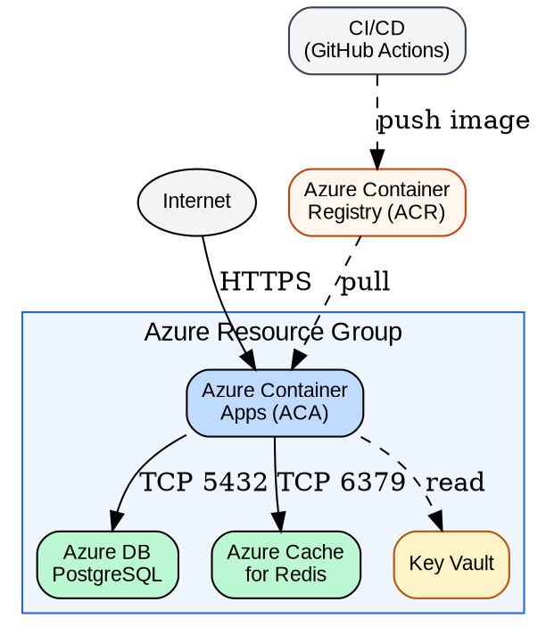
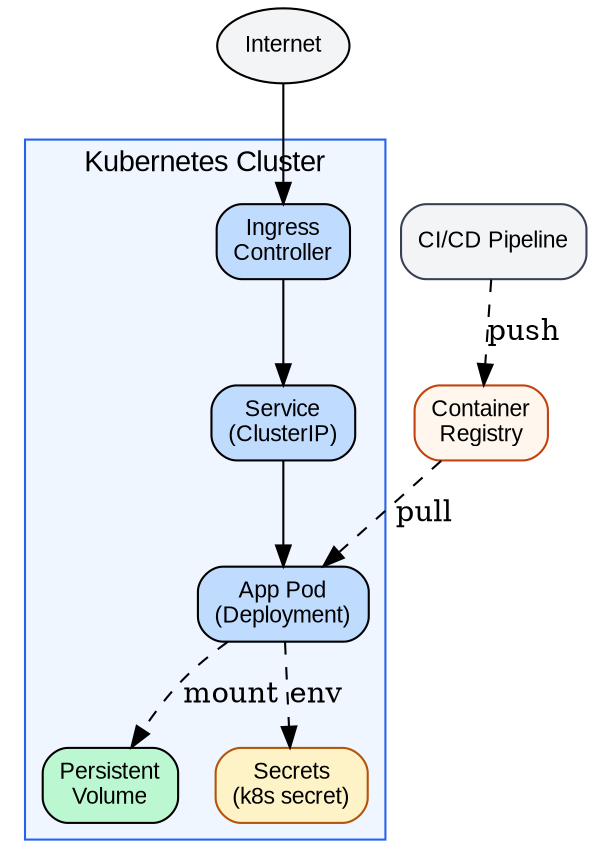
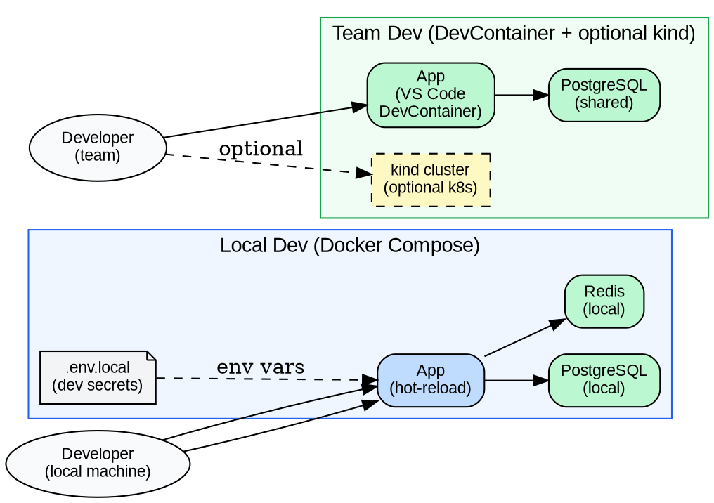

# devops-report

## Overview

Read `devops/working/analysis.json` and `devops/working/security-findings.json` plus the generated file list. Produce `devops/report/index.html` — a single self-contained HTML file with embedded SVG diagrams, no external dependencies.

## Inputs

Read these files before generating the report:
- `devops/working/analysis.json`
- `devops/working/security-findings.json`
- List all files in `devops/working/` (for the artifacts table)

## Diagram Generation

For each diagram, write a Graphviz DOT definition mentally then render it as SVG text. SVG generation approach: translate nodes/edges to SVG `<rect>`, `<text>`, `<line>`, and `<path>` elements with approximate layout. Use `rankdir=LR` for left-to-right pipelines, `rankdir=TB` for top-down architectures. Clusters become `<rect>` with labels.

### Diagram 1: Architecture Overview (C4 Container Level)



Adapt node labels to the actual detected stack. Remove services not present in `stack.database`.

### Diagram 2: CI/CD Pipeline

```dot
digraph pipeline {
  rankdir=LR
  graph [fontname="Arial" bgcolor="transparent"]
  node [shape=box style="filled,rounded" fontname="Arial" fontsize=11 width=1.2]
  edge [fontname="Arial" fontsize=9]

  lint [label="Lint\n+ SAST\n+ Secrets" fillcolor="#fef9c3" color="#92400e"]
  test [label="Test\n+ Coverage" fillcolor="#fef9c3" color="#92400e"]
  build [label="Build\n+ Push\nImage" fillcolor="#dbeafe" color="#1d4ed8"]
  scan [label="Security\nScan\n(Trivy)" fillcolor="#fee2e2" color="#991b1b"]
  staging [label="Deploy\nStaging" fillcolor="#dcfce7" color="#15803d"]
  dast [label="DAST\n(ZAP)" fillcolor="#fee2e2" color="#991b1b"]
  approval [label="Manual\nApproval" shape=diamond fillcolor="#fef3c7" color="#b45309"]
  prod [label="Deploy\nProduction" fillcolor="#dcfce7" color="#15803d"]

  lint -> test -> build -> scan -> staging -> dast -> approval -> prod
}
```



### Diagram 3: Deployment Topology

Generate based on `choices.cloud_provider` and `choices.deployment_target`. If no variant matches the detected provider, use the Kubernetes diagram as the default.

**AWS + Containers (ECS):**



**GCP + Cloud Run:**


**Azure + Container Apps:**


**Kubernetes:**


### Diagram 4: Dev Environment Topology



Adapt based on detected databases from `stack.database`.

## Report Sections

Generate the following 8 sections in order:

1. **Executive Summary** — stack (language, framework, cloud, deployment, secrets, team size), scenario label, 3 key decisions from `analysis.json`, top 3 findings from `security-findings.json` by severity.
2. **Architecture Overview** — Diagram 1 embedded as inline SVG.
3. **Deployment Architecture** — Diagram 3 embedded as inline SVG.
4. **CI/CD Workflow** — Diagram 2 embedded as inline SVG + table of pipeline stages.
5. **Dev Environments** — Diagram 4 embedded as inline SVG + setup instructions.
6. **Generated Artifacts** — table of every file in `devops/working/` with a one-line description. Infer the Purpose column from the filename: `Dockerfile` → "Multi-stage production container image", `Dockerfile.dev` → "Dev container with hot-reload", `.dockerignore` → "Files excluded from Docker build context", `docker-compose.yml` → "Local dev stack (single machine)", `docker-compose.team.yml` → "Shared team dev stack with DevContainer", `docker-compose.prod.yml` → "Production compose reference", `devcontainer.json` → "VS Code DevContainer configuration", `ci.yml` → "GitHub Actions CI/CD pipeline", `.gitlab-ci.yml` → "GitLab CI pipeline", `config.yml` → "CircleCI pipeline", `setup-local.sh` → "One-command local dev setup script", `setup-team.sh` → "One-command team dev setup script", `main.tf` → "Terraform infrastructure (cloud resources)", `variables.tf` → "Terraform variable definitions", `*.tfvars` → "Terraform environment-specific variable values", Kubernetes `.yaml` files → "Kubernetes manifest (resource type from filename)".
7. **Security Report** — severity counts (critical/high/medium/low), findings table sorted Critical → High → Medium → Low.
8. **Recommendations** — prioritized list derived from: (a) `security-findings.json` critical and high findings, each becoming a recommended action; (b) any `recommendations[]` array in `analysis.json` if present; (c) AI-inferred improvements from the detected stack and choices. For the review scenario, contrast each recommendation with the specific existing config issue it addresses.

**Placeholder substitution reference:**
- `{date}` — today's date in ISO format `YYYY-MM-DD` (use current system date)
- `{scenario_label}` — map from `scenario` field: `"design"` → `"New Project Design"`, `"codebase"` → `"Existing Codebase"`, `"review"` → `"Config Review"`
- `{project_name}` — from `analysis.json` → `project_name`; if absent, use the current directory name as fallback
- `{cloud_provider}`, `{ci_cd_platform}`, `{deployment_target}`, `{secrets_management}`, `{team_size}` — from `analysis.json` → `choices.*`
- `{language}`, `{framework}` — from `analysis.json` → `stack.*`
- `{critical_count}`, `{high_count}`, `{medium_count}`, `{low_count}` — from `security-findings.json` → `summary.*`

For the **review scenario only**: add a "Before vs After" section between Recommendations and the end. In the HTML template this section is wrapped in `<!-- -->` comment delimiters — **remove those delimiters** and populate the table rows with data comparing existing config issues (from `security-findings.json`) against the improvements in the generated configs.

## HTML Template

Substitute all `{placeholder}` values from `analysis.json` and `security-findings.json`. Populate the SVG diagram slots and fill in all table rows.

```html
<!DOCTYPE html>
<html lang="en">
<head>
  <meta charset="UTF-8">
  <meta name="viewport" content="width=device-width, initial-scale=1.0">
  <title>DevOps Report — {project_name}</title>
  <style>
    :root {
      --blue: #2563eb; --green: #16a34a; --yellow: #d97706;
      --red: #dc2626; --gray-50: #f9fafb; --gray-100: #f3f4f6;
      --gray-200: #e5e7eb; --gray-700: #374151; --gray-900: #111827;
    }
    * { box-sizing: border-box; margin: 0; padding: 0; }
    body { font-family: -apple-system, BlinkMacSystemFont, 'Segoe UI', sans-serif;
           color: var(--gray-900); background: #fff; line-height: 1.5; }
    .container { max-width: 1100px; margin: 0 auto; padding: 2rem 1.5rem; }
    header { background: var(--blue); color: #fff; padding: 2rem 2.5rem;
             margin-bottom: 2.5rem; border-radius: 10px; }
    header h1 { font-size: 1.8rem; margin-bottom: 0.4rem; }
    header .meta { opacity: 0.85; font-size: 0.9rem; }
    section { margin-bottom: 2.5rem; }
    h2 { font-size: 1.25rem; color: var(--blue); padding-bottom: 0.5rem;
         border-bottom: 2px solid var(--gray-200); margin-bottom: 1.25rem; }
    h3 { font-size: 1.05rem; color: var(--gray-700); margin-bottom: 0.75rem; margin-top: 1.25rem; }
    .diagram-wrap { background: var(--gray-50); border: 1px solid var(--gray-200);
                    border-radius: 8px; padding: 1.5rem; margin: 1rem 0;
                    overflow-x: auto; text-align: center; }
    table { width: 100%; border-collapse: collapse; font-size: 0.875rem; }
    th { background: var(--gray-100); padding: 0.6rem 0.875rem; text-align: left;
         font-weight: 600; border-bottom: 2px solid var(--gray-200); }
    td { padding: 0.55rem 0.875rem; border-bottom: 1px solid var(--gray-200);
         vertical-align: top; }
    tr:last-child td { border-bottom: none; }
    .badge { display: inline-block; padding: 0.15rem 0.55rem; border-radius: 20px;
             font-size: 0.75rem; font-weight: 600; letter-spacing: 0.02em; }
    .badge-critical { background: #fee2e2; color: var(--red); }
    .badge-high { background: #ffedd5; color: #c2410c; }
    .badge-medium { background: #fef9c3; color: #92400e; }
    .badge-low { background: #dcfce7; color: var(--green); }
    .counts { display: flex; gap: 1rem; margin-bottom: 1.25rem; flex-wrap: wrap; }
    .count-card { flex: 1; min-width: 100px; background: var(--gray-50);
                  border: 1px solid var(--gray-200); border-radius: 8px;
                  padding: 1rem; text-align: center; }
    .count-num { font-size: 2rem; font-weight: 700; line-height: 1; }
    .count-card.critical .count-num { color: var(--red); }
    .count-card.high .count-num { color: #c2410c; }
    .count-card.medium .count-num { color: #92400e; }
    .count-card.low .count-num { color: var(--green); }
    .count-label { font-size: 0.8rem; color: var(--gray-700); margin-top: 0.25rem; }
    .recs { list-style: none; }
    .recs li { padding: 0.6rem 0; border-bottom: 1px solid var(--gray-200);
               display: flex; gap: 0.6rem; }
    .recs li::before { content: "→"; color: var(--blue); font-weight: bold;
                       flex-shrink: 0; margin-top: 0.1rem; }
    .setup-cmd { background: #1e293b; color: #e2e8f0; padding: 0.75rem 1rem;
                 border-radius: 6px; font-family: monospace; font-size: 0.875rem;
                 margin: 0.5rem 0; }
    .stack-grid { display: grid; grid-template-columns: repeat(auto-fit, minmax(200px, 1fr));
                  gap: 0.75rem; margin-bottom: 1.25rem; }
    .stack-item { background: var(--gray-50); border: 1px solid var(--gray-200);
                  border-radius: 6px; padding: 0.75rem 1rem; }
    .stack-item .label { font-size: 0.75rem; color: var(--gray-700); font-weight: 600;
                         text-transform: uppercase; letter-spacing: 0.05em; }
    .stack-item .value { font-size: 0.95rem; font-weight: 500; margin-top: 0.15rem; }
    @media print {
      header { background: #1e40af !important; -webkit-print-color-adjust: exact; }
      .diagram-wrap { page-break-inside: avoid; }
    }
  </style>
</head>
<body>
<div class="container">

  <header>
    <h1>DevOps Report — {project_name}</h1>
    <div class="meta">
      Scenario: {scenario_label} &nbsp;|&nbsp;
      Generated: {date} &nbsp;|&nbsp;
      Cloud: {cloud_provider} &nbsp;|&nbsp;
      CI/CD: {ci_cd_platform}
    </div>
  </header>

  <section>
    <h2>Executive Summary</h2>
    <div class="stack-grid">
      <div class="stack-item">
        <div class="label">Language</div>
        <div class="value">{language}</div>
      </div>
      <div class="stack-item">
        <div class="label">Framework</div>
        <div class="value">{framework}</div>
      </div>
      <div class="stack-item">
        <div class="label">Cloud</div>
        <div class="value">{cloud_provider}</div>
      </div>
      <div class="stack-item">
        <div class="label">Deployment</div>
        <div class="value">{deployment_target}</div>
      </div>
      <div class="stack-item">
        <div class="label">Secrets</div>
        <div class="value">{secrets_management}</div>
      </div>
      <div class="stack-item">
        <div class="label">Team Size</div>
        <div class="value">{team_size}</div>
      </div>
    </div>
    <h3>Top Security Findings</h3>
    <table>
      <thead>
        <tr><th>Severity</th><th>Category</th><th>Finding</th></tr>
      </thead>
      <tbody>
        <!-- Insert up to 3 rows from security-findings.json sorted Critical → High → Medium → Low.
             Use <span class="badge badge-critical">Critical</span> (or high/medium/low) for the Severity cell. -->
      </tbody>
    </table>
  </section>

  <section>
    <h2>Architecture Overview</h2>
    <div class="diagram-wrap">
      <!-- Diagram 1 SVG embedded here -->
    </div>
  </section>

  <section>
    <h2>Deployment Architecture</h2>
    <div class="diagram-wrap">
      <!-- Diagram 3 SVG embedded here -->
    </div>
  </section>

  <section>
    <h2>CI/CD Workflow</h2>
    <div class="diagram-wrap">
      <!-- Diagram 2 SVG embedded here -->
    </div>
    <h3>Pipeline Stages</h3>
    <table>
      <thead><tr><th>Stage</th><th>Jobs</th><th>Gate</th></tr></thead>
      <tbody>
        <tr><td>lint</td><td>ESLint, Semgrep SAST, Gitleaks</td><td>Blocks test on failure</td></tr>
        <tr><td>test</td><td>Unit + integration tests with real DB</td><td>Blocks build on failure</td></tr>
        <tr><td>build</td><td>Multi-stage Docker build, push to registry</td><td>Main branch only for push</td></tr>
        <tr><td>security-scan</td><td>Trivy CVE scan on built image</td><td>Main branch only; blocks deploy on Critical/High</td></tr>
        <tr><td>deploy-staging</td><td>Deploy to staging environment</td><td>Auto after security scan passes</td></tr>
        <tr><td>dast</td><td>OWASP ZAP baseline scan on staging</td><td>Non-blocking (report only)</td></tr>
        <tr><td>deploy-prod</td><td>Deploy to production environment</td><td><strong>Manual approval required</strong></td></tr>
      </tbody>
    </table>
  </section>

  <section>
    <h2>Dev Environments</h2>
    <div class="diagram-wrap">
      <!-- Diagram 4 SVG embedded here -->
    </div>
    <h3>Quick Start</h3>
    <!-- Only include each setup-cmd block if the corresponding script was generated (check devops/working/scripts/ file list) -->
    <p><strong>Local dev (single machine):</strong></p>
    <div class="setup-cmd">./devops/working/scripts/setup-local.sh</div>
    <p style="margin-top:0.75rem"><strong>Team dev (DevContainer):</strong></p>
    <div class="setup-cmd">./devops/working/scripts/setup-team.sh</div>
  </section>

  <section>
    <h2>Generated Artifacts</h2>
    <table>
      <thead><tr><th>File</th><th>Purpose</th></tr></thead>
      <tbody>
        <!-- One row per file in devops/working/, generated from file list -->
      </tbody>
    </table>
  </section>

  <section>
    <h2>Security Report</h2>
    <div class="counts">
      <div class="count-card critical">
        <div class="count-num">{critical_count}</div>
        <div class="count-label">Critical</div>
      </div>
      <div class="count-card high">
        <div class="count-num">{high_count}</div>
        <div class="count-label">High</div>
      </div>
      <div class="count-card medium">
        <div class="count-num">{medium_count}</div>
        <div class="count-label">Medium</div>
      </div>
      <div class="count-card low">
        <div class="count-num">{low_count}</div>
        <div class="count-label">Low</div>
      </div>
    </div>
    <table>
      <thead>
        <tr><th>Severity</th><th>Category</th><th>Finding</th><th>Remediation</th></tr>
      </thead>
      <tbody>
        <!-- Rows from security-findings.json, sorted Critical → High → Medium → Low -->
      </tbody>
    </table>
  </section>

  <section>
    <h2>Recommendations</h2>
    <ul class="recs">
      <!-- Prioritized list. For review scenario: reference specific existing config
           issues found vs what was generated as improvement -->
    </ul>
  </section>

  <!-- Only for review scenario: -->
  <!--
  <section>
    <h2>Before vs After</h2>
    <table>
      <thead><tr><th>Area</th><th>Before (existing config)</th><th>After (generated config)</th></tr></thead>
      <tbody>
        <tr>
          <td>CI pipeline</td>
          <td>No security scanning stages, no approval gate for prod</td>
          <td>Semgrep + Trivy + Gitleaks in CI, manual approval before prod deploy</td>
        </tr>
      </tbody>
    </table>
  </section>
  -->

</div>
</body>
</html>
```

## SVG Rendering Instructions

Use a simplified schematic approach — not Graphviz fidelity, but a readable diagram the user can follow. The goal is clarity, not pixel-perfect layout.

**Define an arrow marker once in `<defs>`:**
```svg
<defs>
  <marker id="arrow" markerWidth="10" markerHeight="7" refX="10" refY="3.5" orient="auto">
    <polygon points="0 0, 10 3.5, 0 7" fill="#6b7280" />
  </marker>
</defs>
```
Use `marker-end="url(#arrow)"` on every edge line/path.

**For `rankdir=LR` diagrams (pipelines):**
- Place nodes in a single horizontal row, spaced 150px apart: node i at `x = 40 + i * 150`, `y = 80`
- Standard node: `<rect>` 110px wide × 55px tall, rx="6"
- `<text>` centered in the rect (use `text-anchor="middle"`, `dominant-baseline="middle"`)
- Edges: `<line>` from right edge of one rect to left edge of next
- If a node has `shape=diamond`, render as a rotated `<rect>` (transform="rotate(45 cx cy)")
- Total SVG width: `40 + n_nodes * 150 + 40`, height: 200

**For `rankdir=TB` diagrams (architecture/deployment):**
- If no clusters: place nodes in rows of up to 4, spaced 160px horizontally, 120px vertically
- If clusters present: draw each cluster as a `<rect>` with a label, then place member nodes inside it with 20px padding
- Suggested cluster layout: position clusters side-by-side or stacked based on their role in the DOT
- Edges: `<line>` from bottom of source node to top of target node (or nearest edges for lateral connections)
- Dashed edges: add `stroke-dasharray="5,3"` to the line
- Edge labels: `<text>` at midpoint of the line, `font-size="10"`, `fill="#6b7280"`, `text-anchor="middle"`
- Total SVG width: 700–900px; height: 400–600px depending on content

**Node rendering rules:**
- `fillcolor` from DOT → `fill` attribute on `<rect>`. Use the hex value verbatim.
- `color` from DOT → `stroke` attribute on `<rect>`
- `shape=ellipse` → use `<ellipse>` with `rx` and `ry` instead of `<rect>`
- `shape=note` → `<rect>` with a small folded corner polygon
- Default node size: 120px × 50px. Multi-line labels (contains `\n`) → increase height to 65px; split on `\n` and render as separate `<tspan dy="1.2em">` lines
- Font: `font-family="Arial, sans-serif"` on all text elements

**Final check:**
- Set `viewBox="0 0 W H"` and explicit `width` and `height` on the root `<svg>` element
- Ensure no two nodes visually overlap

## Output

Create the `devops/report/` directory if it doesn't exist. Write the completed HTML to `devops/report/index.html`.

After writing, confirm:

```
Report generated: devops/report/index.html
  Sections: 8 (+ Before/After for review scenario)
  Diagrams: 4 (Architecture, Deployment, CI/CD Pipeline, Dev Environments)
  Security findings: N total (C critical, H high, M medium, L low)

Open with: open devops/report/index.html
```
